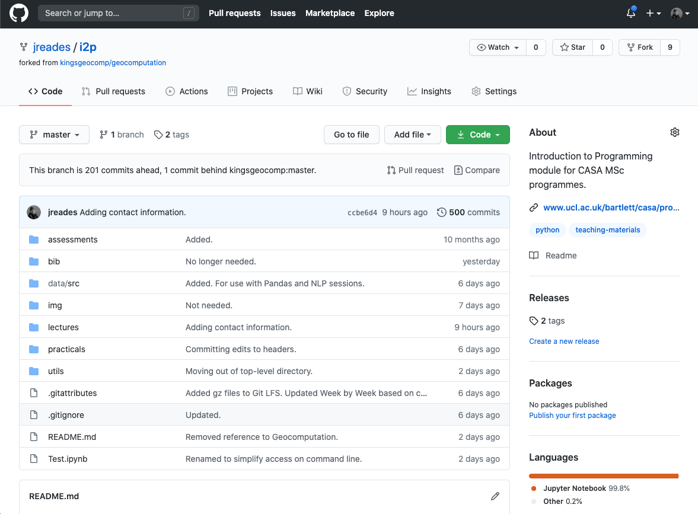
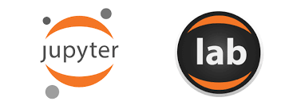
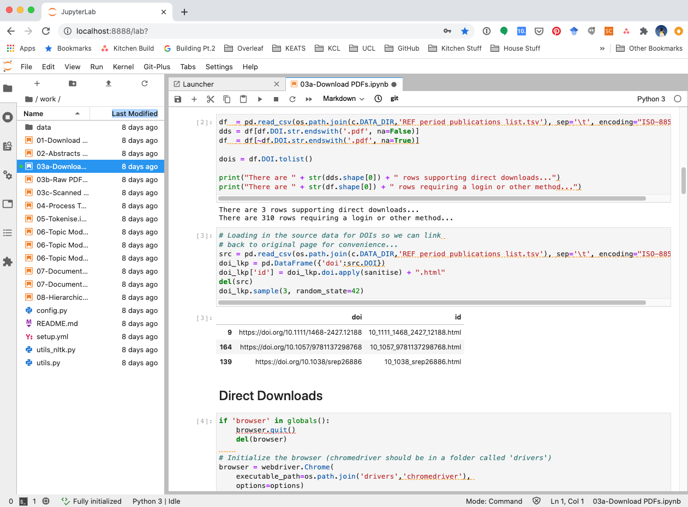
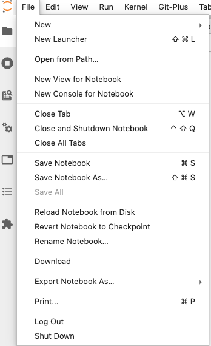
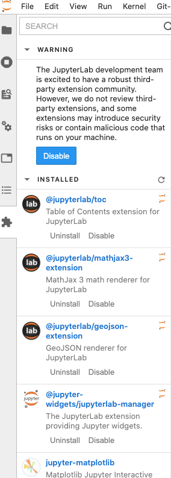
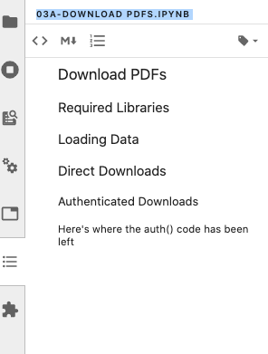
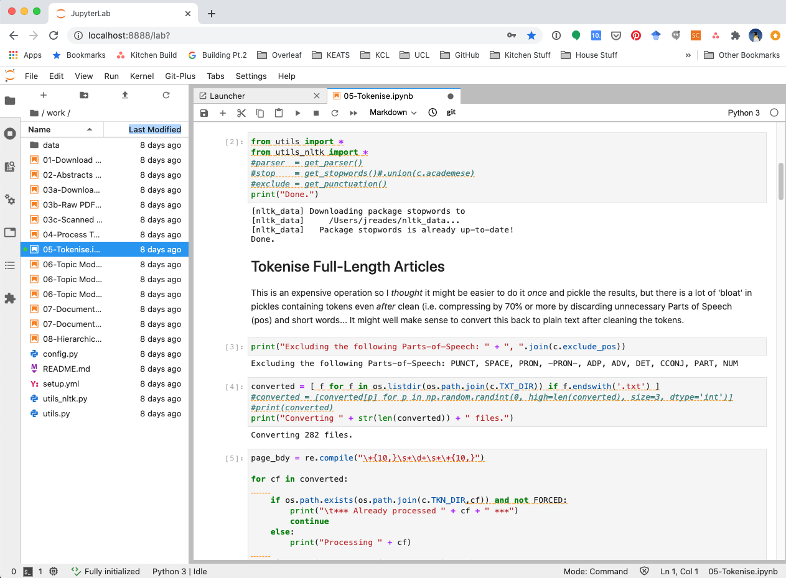

Title: Writing Code
Author: Jon Reades
Theme: casa notes
Palette: Purple
Size: Wide
## Changes in this version：
1. The ordinary directory of images was changed to my file.
2. Some emphases were changed.
---
Layout: Title
# Writing Code
---
## Don't Just Start Coding...
There are three parts to writing code:

- Managing it
- Documenting it
- Writing it

Notice that writing comes *last*.

---

## Managing Code

> Why can't we write code the same way that we write an essay?

---
Layout: Split
### Git

Version control allows us to:

1. Track changes to files with a high level of detail using `commit`.
2. `push` these changes out so that they are shared with others.
3. `pull` down made by others down to our own computers.
4. `merge` and resolve conflicting changes.
5. Create and delete a `tag` as 'milestones' are reached.
6. Create and merge a `branch` as 'features' are added/removed.
7. Retrieve particular versions or branches using a `checkout`.

---
Layout: Split
### GitHub


+++
Git is distributed, meaning that every computer is a potential server *and* a potential authority. **Result**: commits on a plane!

But how do people find and access your code if your 'server' is a home machine that goes to sleep at night? **Result**: GitHub.

GitHub is 'just' a very large Git server with a *lot* of nice web-friendly features tacked on: create a web site, issue/bug tracking, promote your project... 

---
### Git+GitHub is for... anything!



^ This whole course (minus videos and assessments) is on GitHub.

---
Layout: SectionTitle
## Documenting Code

There is a lot more to documenting your code than just adding comments.

---
Layout: Split

+++
Markdown is intended to:

- Make it easy to write and format text (headings, tables, **bold**, *italics*...).
- Make it easy to embed rich media (video, images).
- Make it easy to take this simply-formatted text and turn it into something *useful* (a web site, journal article, documentation...).
---
For those who know how to do it, you can also insert bits of real HTML and CSS (the 'languages' of web sites) as well.

<div style="border: dotted 2px red; padding: 25px; margin-top: 25px; background-color: rgb(230,230,230)">This content has HTML formatting attached.</div>

---
### Why Use It?

Together features that make it easy to use have *real* advantages for *you*:

1. You will spend less time wrestling with Microsoft Word and its formatting; this means that...
2. You will spend more time focussing on the important stuff: writing and coding!
3. You will be able to combine Code and Documentation easily because Python/R and Markdown all coexist happily on GitHub.
4. In R (Python is slightly tricker here) you can combine Markdown text with R code using something called `knitr` to 'compile' an article or essay; your code, your output, and your analysis are *always* in one place.

---
### Markdown Examples

See [GitHub](https://github.com/jreades/i2p/blob/master/lectures/1.3-Writing_Code.md#markdown-examples):

<table style="border: solid 1px rgb(230,230,230)">
  <tr>
    <th>Format</th><th>Output</th>
  </tr><tr>
    <td>Plain text...</td><td>Plain text</td>
	</tr><tr>
  	<td>## A Large Heading</td><td><h2>A Large Heading</h2></td>
  </tr><tr>
  	<td>### A Medium Heading</td><td><h3>A Medium Heading</h3></td>
  </tr><tr>
  	<td>- A list<br />- More list</td><td><ul>
  		<li>A list</li>
  		<li>More list</li>
  	</ul></td>
  </tr><tr>
  	<td>1. An ordered list<br />2. More ordered list</td>
  	<td><ol>
      <li>An ordered list</li>
      <li>More ordered list</li>
      </ol></td>
  </tr><tr>
  	<td>[A link](http://casa.ucl.ac.uk)</td><td><a href="http://casa.ucl.ac.uk">A link</a></td>
  </tr>
</table>
---
<table style="border: solid 1px rgb(230,230,230)">
  <tr>
    <th>Format</th><th>Output</th>
  </tr><tr>
  	<td></td><td></td>
  </tr><tr>
  	<td>`A code snippet`</td><td><tt>A code snippet</tt></td>
  </tr><tr>
  	<td>```<br />
  	A block of Python code<br />
    ```
  	</td><td>
  Code would go here...
  	</td>
  </tr>
</table>
---

### More Markdown...

Here are some more resources:

- [Getting Started](https://www.markdownguide.org/getting-started/)
- [An online interactive tutorial](https://www.markdowntutorial.com)
- [Cheatsheet](https://github.com/adam-p/markdown-here/wiki/Markdown-Cheatsheet)

And once you're ready to get 'serious', check out [this tutorial](https://programminghistorian.org/en/lessons/sustainable-authorship-in-plain-text-using-pandoc-and-markdown) on *Sustainable Authorship in Plain Text using Pandoc and Markdown* from [The Programming  Historian](https://programminghistorian.org/en/lessons/)!

---

### Markdown is for... anything!

This whole course, [including this presentation](https://github.com/jreades/i2p/blob/master/lectures/1.3-Writing_Code.md) was writting in Markdown.

---

## Writing & Running Code

> In an ideal world, we would say what we wanted the computer to do and it would do it. More frequently, we rush off with some half-formed thoughts, write some code that kind of does what we want, and then can't recall why wanted that in the first place. This has... consequences:

<div style="border: dotted 2px red; padding: 10px; text-weight: stronger"><em>Not a joke:</em> I have been known to delete poorly-commented and documented code on the basis that it was 'inefficient' or 'unnecessary'... Results have included (briefly) taking down a corporate web site.</div>

^ *Note:* I do not mean Siri here.

^ *Also:* thank god for version control (even if was, then, only [CVS](https://www.gnu.org/software/trans-coord/manual/cvs/cvs.html)).

---

### Literate Programming

Ideally, we want to write code in ways that are '[literate](https://en.wikipedia.org/wiki/Literate_programming)'. 

> The best programs are written so that computing machines can perform them quickly and so that human beings can understand them clearly. A programmer is ideally an essayist who works with traditional aesthetic and literary forms as well as mathematical concepts, to communicate the way that an algorithm works and to convince a reader that the results will be correct.
>
> -- <cite>Donald Knuth, *[Selected Papers on Computer Science](https://www.goodreads.com/work/quotes/108081)*</cite>

---

### Key Tenets

What we want:

1. **Weaving**: the code and its documentation are together in one file.
2. **Tangling**: the code can be run directly from this file.

Why do we want this?

---

### Jupyter(Lab) & Notebooks



Modern Browser + Jupyter == Tangled, Woven code in (m)any languages

^ *Note*: you can set equations in Markdown too!

---

### JupyterLab + Python



---
Layout: HeaderAndColumns
### All Kinds of Features

JupyterLab is basically a web application and, as such, has all kinds of features:

+++

+++

+++


---
### JupyterLab Uses Markdown


---

### Tie These Together...



---

## Recap

1. With **Git + GitHub** we have a way to 'version' text, code, images, etc. and distribute them online via both a browser and the command line.
2. With **Markdown** we have a way to easily produce content (essays, documentation, web sites, presentations) and convert or distribute it via both a browser and the commenad line.
3. With JupyterLab we have a way to write code and documentation in an '**woven**' manner using Markdown and GitHub.
